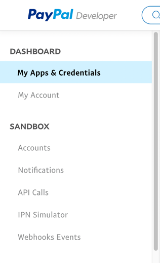
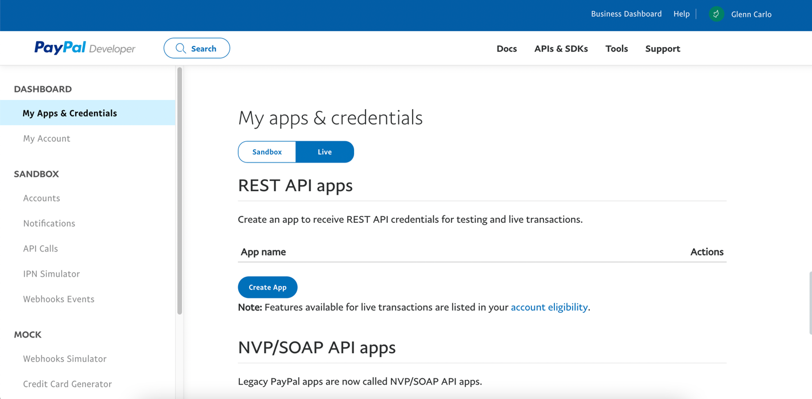
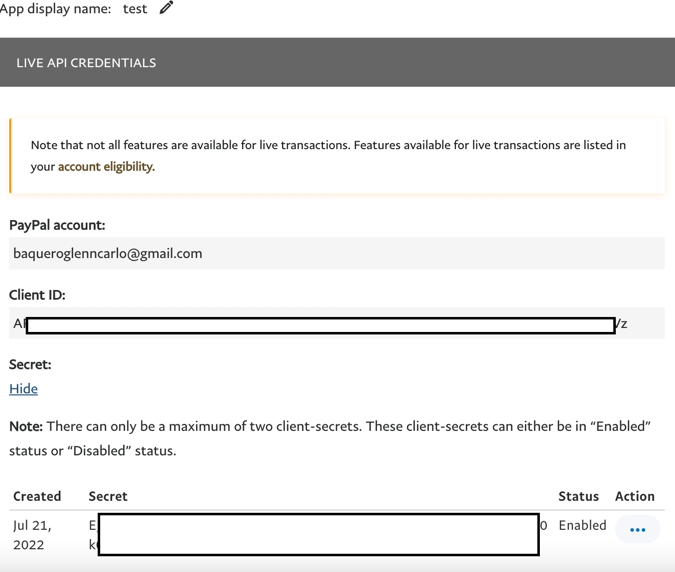
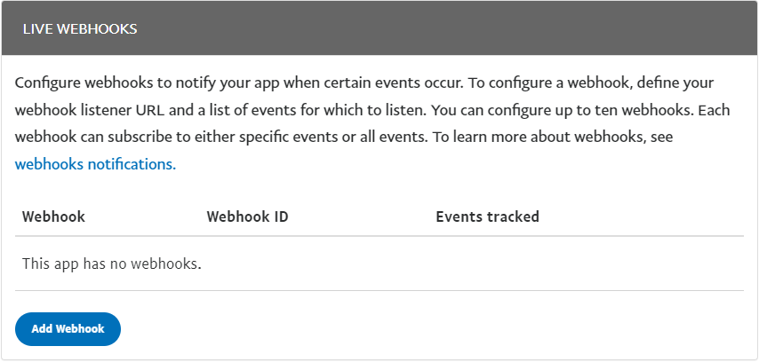
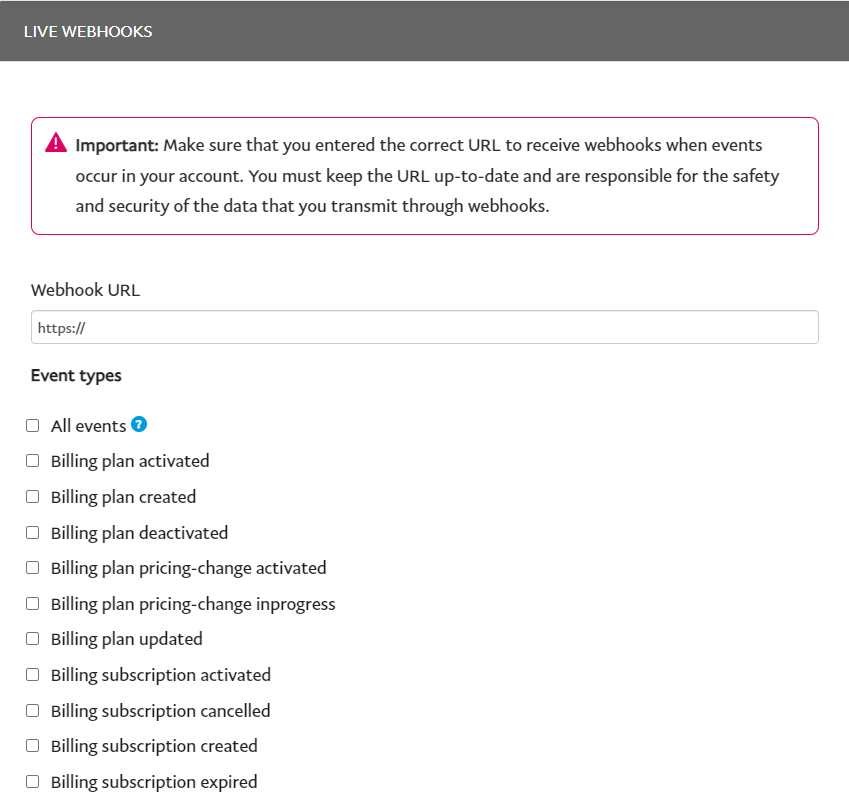

# Bacherlordruck Website

## Installation

```
# Create databases
mysql -e "CREATE DATABASE bachelordruck"
mysql -e "CREATE DATABASE bachelordruck_test"

# Install dependencies
composer install
npm install

# Setup database credetials
cp .env.example .env
php artisan key:generate
php artisan migrate --seed

# Regenerate liverwire components manifest
php artisan livewire:discover
```

## Development
```
# Run this only once and if css do not compile correctly
npm add -D sass

npm run dev
```

## Paypal Test Account (Sandbox)
- Paypal
  - email: `sb-nnktx18261646@personal.example.com`
  - password: `:p&?8S72`
- Bank (IBAN)
  - account number: `DE20100000000005469207`
- Credit card
  - United State 
    - card number: `4032032040415595`
    - expiration date: `01/2023`
    - cvv: `469`
  - Germany
    - card number: `4020021783055373`
    - expiration date: `09/2027`
    - cvv: `420`

## Paypal Sandbox to Production
1. Login to [paypal developer](https://developer.paypal.com/)
2. Generate client id and secret key at [My Apps & Credentials](https://developer.paypal.com/developer/applications)


3. In `My Apps & Credentials` section you will see two tabs `Sandbox` and `Live`, click the `Live` tab to generate key for production



4. Click the `Create App` button and you will see a form, after you submit the form you will able to see the `Live API Credentials`  



5. In `LIVE WEBHOOKS` section click the `Add webhook` button to add our production url and then select events which are part of our system




6. Copy the `Client ID` and `Secret Key` then update the `.env` and add/update this line
```
PAYPAL_CLIENT_ID=your_client_id
PAYPAL_SECRET=your_secret_key
```
